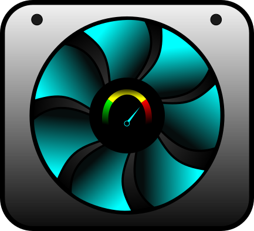

# MacFanControl

<p align="center">
  
</p>

A lightweight fan control daemon for 2015 Intel MacBook Pro (MacBookPro11,5).

> Should be adaptable to other Intel MacBook models as well — the probe tool will identify your specific SMC keys.

Built as a minimal replacement for Macs Fan Control, which caused severe system slowdowns on this hardware. This project uses less than 1% of CPU and a few MB of RAM.

---

## Why This Exists

Macs Fan Control is a great app, but on older MacBook Pros it can cause the system to become nearly unusable due to CPU and RAM overhead. This project does exactly one thing well: read sensor temperatures and adjust fan speed accordingly, with almost zero system impact.

Apple's built-in auto fan control on the 2015 MacBook Pro is overly aggressive — fans ramp up fast and stay high long after temperatures drop. This daemon uses a smoother curve that keeps the machine quiet at idle while still pushing hard enough under load to avoid macOS's thermal throttling (`CPU_Speed_Limit`). See [CPU Throttling & Speed Limit Watchdog](#cpu-throttling--speed-limit-watchdog) below for why this matters more than it sounds.

---

## Target Hardware

- **Machine:** MacBookPro11,5 (MacBook Pro Retina 15-inch, Mid 2015)
- **CPU:** Quad-Core Intel Core i7 2.8 GHz
- **GPU:** AMD Radeon R9 M370X + Intel Iris Pro
- **OS:** macOS Monterey 12.7.6
- **SMC:** Version 2.30f2

May work on other 2013–2015 Intel MacBook Pros with similar SMC key layouts. The probe tool will tell you what keys your machine exposes.

---

## Features

- Configurable target sensor — drive the fan curve off whichever SMC key runs hottest on your machine (TC0F by default)
- Exponential fan curve — more aggressive ramp in the mid-range where throttling tends to start, gentle at idle
- Independent RPM control for left and right fans
- Configurable curve, floor RPM, hysteresis, and ramp-down cooldown
- Emergency override at configurable temperature ceiling
- **CPU_Speed_Limit watchdog** — live background listener on `pmset -g thermlog`. Forces max fan speed on early throttling and hands off to Apple auto control if throttling becomes severe
- Manual override modes — Auto, Manual (fixed RPM), and Max, controllable from the menu bar
- Automatic restore to Apple control on crash, exit, or emergency
- Runs as a login daemon via launchd — daemon does **not** auto-start by default; start/stop from the menu bar or `macfan` alias
- Menu bar display showing target sensor temp, GPU temp, CPU speed limit %, fan RPM, and current mode
- Dry-run mode for testing without touching the fans
- Single install script handles all setup automatically
- Extremely low resource usage

---

## Project Structure

```
MacFanControl/
├── native/
│   ├── smc.c               # SMC implementation (from smcFanControl, GPL v2)
│   ├── smc.h
│   ├── macfan_smc.c        # Lightweight CLI helper wrapping smc.c
│   └── Makefile
│
├── sensors.py              # Subprocess wrapper around macfan_smc
├── fan_curve.py            # Fan curve calculation (pure, no I/O)
├── speed_watcher.py         # Background pmset thermlog listener (daemon-side)
├── override.py             # Shared override.json read/write (Auto/Manual/Max)
├── daemon.py               # Main daemon loop
├── menubar.py              # Menu bar status display + manual controls
├── config.json             # User configuration
├── macfan.sh               # Process management shortcuts
├── install.sh              # Automated install script
│
├── com.macfancontrol.daemon.plist    # launchd template (daemon, RunAtLoad=false)
├── com.macfancontrol.menubar.plist   # launchd template (menu bar, RunAtLoad=true)
│
└── tests/
    └── probe.py            # Read all sensors and fan info (no writes)
```

---

## Requirements

- macOS (tested on Monterey 12.7.6)
- Xcode Command Line Tools
- Python 3

Install Xcode Command Line Tools if needed:
```bash
xcode-select --install
```

---

## Installation

### 1. Clone the repo

```bash
git clone https://github.com/91kinks/MacFanControl.git
cd MacFanControl
```

### 2. Build the SMC helper binary

```bash
cd native
make check    # verify your build environment
make
cd ..
```

### 3. Run the probe to verify your sensors

```bash
python3 tests/probe.py
```

This dumps all temperature keys and fan info from your SMC with no writes. Look for the hottest-running sensor under load — on the MacBookPro11,5 this is `TC0F`. The GPU die sensor `TG0D` is also useful as a secondary/display value. If your machine reports different keys, update `config.json` before proceeding.

### 4. Review and edit config.json

```json
{
    "binary": "native/macfan_smc",

    "sensor": {
        "gpu_temp_key": "TG0D",
        "cpu_temp_key": "TC0F",
        "target_sensor_key": "cpu"
    },

    "poll_interval_seconds": 3,

    "fan0": {
        "label": "Left side",
        "floor_rpm": 3100,
        "max_rpm": 6156
    },

    "fan1": {
        "label": "Right side",
        "floor_rpm": 3000,
        "max_rpm": 5700
    },

    "curve": {
        "start_temp": 60,
        "max_temp": 85,
        "hysteresis": 2,
        "exponent": 0.6,
        "cooldown_seconds": 45
    },

    "safety": {
        "emergency_temp": 85,
        "sensor_fail_action": "auto",
        "speed_limit_warn": 70,
        "speed_limit_emergency": 60
    },

    "log_threshold_temp": 80
}
```

**Config notes:**

- **`target_sensor_key`** — `"cpu"` or `"gpu"`. Selects which of `cpu_temp_key` / `gpu_temp_key` actually drives the fan curve and emergency logic. The other one is read for display only. On the MacBookPro11,5, `cpu_temp_key` is set to `TC0F` (hottest sensor on the board, not strictly "CPU-only") and used as the target — this gives the curve visibility into combined CPU+GPU load rather than GPU die temp alone.
- **`floor_rpm`** — the RPM both fans hold at rest. Raising this (e.g. 3000-3100 vs. the original 2600) keeps the machine running cooler at idle, which gives the curve less ground to make up once load hits.
- **`start_temp` / `max_temp`** — the active ramp range. `max_temp` is also where fans hit hardware maximum. Lowering `max_temp` (85°C vs. the original 95°C) means fans reach full speed *before* macOS's thermal governor starts throttling, not after.
- **`hysteresis`** — degrees below `start_temp` the temp must drop before ramp-down is even considered. Kept low (2°C) because `cooldown_seconds` already handles oscillation prevention — the two together being too conservative caused fans to never ramp down in testing.
- **`exponent`** — shapes the curve. `1.0` = linear (original behavior). Values below `1.0` (e.g. `0.6`) push more RPM into the middle of the temperature range — exactly the 70-80°C zone where throttling tends to start — without being loud at idle. Values above `1.0` do the opposite (quiet until near `max_temp`, then aggressive).
- **`cooldown_seconds`** — once temp drops below `start_temp - hysteresis`, fans must stay there for this many seconds (and `CPU_Speed_Limit` must be healthy) before RPM is allowed to decrease. This is what prevents fans from backing off the moment they've made progress, only to let temps creep back up.
- **`speed_limit_warn` / `speed_limit_emergency`** — see [CPU Throttling & Speed Limit Watchdog](#cpu-throttling--speed-limit-watchdog).
- **`log_threshold_temp`** — daemon only logs to stdout above this temperature, keeping the log file manageable during normal operation.

### 5. Set up the Python environment

```bash
python3 -m venv venv
source venv/bin/activate
pip install rumps
```

### 6. Test with dry-run

```bash
sudo python3 daemon.py --dry-run
```

This runs the full loop — reading sensors, computing targets, checking the speed limit watchdog — without writing anything to the SMC. Verify the startup banner shows the values you expect (target sensor, curve range, exponent, cooldown, speed limit thresholds), then Ctrl+C to exit.

### 7. Test fan write and restore

```bash
sudo python3 daemon.py
```

In a separate terminal, verify the fans are responding:

```bash
native/macfan_smc fans
```

Confirm that `Mode` shows `forced` and the target RPMs align with your config. Ctrl+C to exit — this cleanly restores Apple auto control before shutting down.

### 8. Run the install script

```bash
chmod +x install.sh
./install.sh
```

The install script will:
- Verify all requirements are met
- Create the logs directory
- Write both launchd plists with correct paths for your system
- Add a passwordless sudo rule for the `macfan_smc` binary only
- Lock the binary to root ownership to prevent privilege escalation
- Add a `macfan` shell alias for process management
- Load the menu bar launch agent

**After install, the menu bar app starts automatically on every login — the daemon does not.** Start the daemon from the menu bar (Daemon → Start Daemon) or run `macfan start daemon` once you're ready. This was changed deliberately so the daemon can be started/stopped on demand without digging into the terminal, and so a fresh login doesn't immediately start writing to the SMC before you've had a chance to check things.

---

## Manual Override Modes

The menu bar dropdown includes a **Mode** section with three options, written to a shared `override.json` file that the daemon checks at the top of every poll cycle:

| Mode     | Behavior |
|----------|----------|
| **Auto**   | Default. The daemon runs the full curve, cooldown, and watchdog logic described above. |
| **Manual** | Both fans are held at a fixed RPM you set. Curve, cooldown, and emergency temp logic are bypassed — only the speed limit emergency watchdog still applies as a final safety net. |
| **Max**    | Both fans are forced to hardware maximum, same as a temperature emergency. |

**Manual mode controls:**

```
Manual RPM: 4000
  [ – 500 ]  [ – 100 ]  [ + 100 ]  [ + 500 ]
  [ Enter RPM... ]
  → Set Manual
```

The `+`/`-` buttons nudge the held RPM value. **Enter RPM...** opens a native dialog for typing an exact value. Values are clamped to the lowest `floor_rpm` and highest `max_rpm` across both fans. **Set Manual** writes the override — the daemon picks it up on its next poll (within `poll_interval_seconds`).

Switching back to **Auto** clears the override. The daemon resets its ramp state and starts fresh from the floor, so there's no leftover cooldown hold from before the override was applied.

This exists as a manual fallback for situations the curve doesn't handle well — sustained heavy load where you'd rather just pin the fans yourself, or quickly silencing them for a video call regardless of temperature.

---

## CPU Throttling & Speed Limit Watchdog

This is the most important addition since the original release, and the reason for several of the config changes above.

### The problem

On the MacBookPro11,5, macOS's thermal governor can assert `CPU_Speed_Limit` (visible via `pmset -g therm` / `pmset -g thermlog`) well before any temperature emergency threshold is reached. If the machine sits at a "warm but not alarming" temperature (e.g. 75-78°C) for too long, macOS throttles the CPU to shed heat — sometimes down to its floor value, from which it **does not recover without a reboot**.

A fan curve that only reacts to temperature can miss this entirely: the temperature looks fine, but the *duration* at that temperature was the problem. The original linear curve with `max_temp: 95` and `start_temp: 66` left too much headroom — fans never got aggressive enough in the 70-80°C range to actually bring temps back down, so the machine would hover there indefinitely under load.

### The fix — three parts working together

1. **Lower `max_temp` (85°C) + exponential curve (`exponent: 0.6`)** — fans ramp harder in the 70-80°C range specifically, the zone where throttling starts. This is enough on its own for most sustained loads (tested against 4K video playback) — temps that hover at 73-78°C get pushed back down into the 60s instead of holding steady.

2. **Cooldown (`cooldown_seconds`)** — once fans ramp up, they hold that RPM until temp has been back below `start_temp - hysteresis` for the full cooldown period. Without this, fans would back off the moment temp dipped slightly, temps would creep back up, and the cycle would repeat without ever making real progress.

3. **Speed limit watchdog (`speed_watcher.py`)** — a background thread runs `pmset -g thermlog` for the life of the daemon and updates instantly whenever `CPU_Speed_Limit` changes (no polling delay). Every tick checks this value:

   - **`speed_limit < speed_limit_warn`** (default 70%) — fans forced to max immediately, cooldown timer reset. The curve's response was too slow; override it.
   - **`speed_limit <= speed_limit_emergency`** (default 60%) — daemon restores Apple auto control and exits. At this point Apple's own (much more aggressive) auto fan response recovers the speed limit faster than our curve can, and 60% gives comfortable margin above the unrecoverable floor (~20%).

The menu bar always displays the current `CPU_Speed_Limit` percentage (via `pmset -g therm` on its normal 3-second refresh), with a `⚠` warning indicator when it drops below `speed_limit_warn` — so you have an at-a-glance signal of throttling state without needing a terminal open.

### Tuning notes

If you're adapting this for your own hardware, the values above (`max_temp: 85`, `exponent: 0.6`, `cooldown_seconds: 45`, `hysteresis: 2`, `floor_rpm` raised to 3000-3100) were arrived at through iterative testing against real throttling events. Start with these as a baseline and adjust `exponent` first if fans feel too aggressive or not aggressive enough in the mid-range — it has the biggest effect on day-to-day noise level without touching the safety thresholds.

---

## Security

MacFanControl requires passwordless sudo access for the `macfan_smc` binary in order to write to the SMC without prompting on every fan update.

The sudoers rule is scoped as narrowly as possible — it grants passwordless sudo for that one specific binary path only, nothing else.

To prevent privilege escalation via binary replacement, `install.sh` automatically locks the binary to root ownership after install:

```
-rwxr-xr-x  root  wheel  native/macfan_smc
```

This means even if an attacker gains user-level access to your machine, they cannot replace the binary with a malicious one without already having root — which breaks the escalation chain.

If you ever rebuild the binary (`make`), re-run `./install.sh` to reapply the ownership lock.

---

## Uninstall

```bash
./install.sh --uninstall
```

This unloads both launch agents (if running), removes the plists, removes the sudoers rule, restores the binary to user ownership, and returns fans to Apple auto control.

---

## Managing Processes

### From the menu bar

The menu bar app includes daemon controls directly in the dropdown:

```
Daemon: ● running
  → Start Daemon
  → Stop Daemon
```

**Start Daemon** / **Stop Daemon** call `launchctl load` / `launchctl unload` on the daemon's launch agent — no terminal needed for everyday use. Stopping the daemon triggers its normal shutdown path, which restores Apple auto fan control before exiting.

### From the terminal

Use the `macfan` alias (added automatically by `install.sh`):

```bash
macfan status               # show whether daemon and menu bar are running
macfan start                # start both
macfan stop                 # stop both
macfan restart              # restart both
macfan start daemon         # start daemon only
macfan stop daemon          # stop daemon only
macfan start menubar        # start menu bar only
macfan stop menubar         # stop menu bar only
macfan restart daemon       # restart daemon only
```

If the alias isn't active yet in your current terminal:
```bash
source ~/.zshrc
```

To start/stop manually without the alias:
```bash
launchctl load   ~/Library/LaunchAgents/com.macfancontrol.menubar.plist
launchctl unload ~/Library/LaunchAgents/com.macfancontrol.menubar.plist
launchctl load   ~/Library/LaunchAgents/com.macfancontrol.daemon.plist
launchctl unload ~/Library/LaunchAgents/com.macfancontrol.daemon.plist
```

**Note:** the menu bar app starts automatically on login (`RunAtLoad: true`); the daemon does not (`RunAtLoad: false`). This is intentional — see [Installation step 8](#8-run-the-install-script).

---

## Manual Fan Control

The `macfan_smc` binary can be used directly without the daemon:

```bash
# Read all temperature sensors
./native/macfan_smc temps

# Read fan info (RPM, min, max, mode)
./native/macfan_smc fans

# Set fan 0 and fan 1 to independent RPM targets
sudo ./native/macfan_smc set-rpm 3000 2800

# Return both fans to Apple auto control
sudo ./native/macfan_smc set-auto
```

---

## How the Fan Curve Works

```
RPM
 ^
max ─────────────────────────────/──────
     |                          /
     |                        /
     |                      ╱
floor─────────────────────╱────
     |              ─────╱
     |         ────╱
     +─────────────────────────────> Target Sensor Temp (C)
              58  60              85
               ↑   ↑               ↑
          ramp-down  ramp-up     emergency
          threshold  threshold    override
```

- **Below `start_temp`** — fans hold at `floor_rpm` (quiet)
- **`start_temp` to `max_temp`** — exponential ramp from `floor_rpm` to `max_rpm`. With `exponent < 1.0`, the curve bulges upward in the middle of the range — fans get noticeably more RPM in the 70-80°C zone than a straight line would give, without being loud right at `start_temp`
- **At `max_temp`** — immediate override to hardware maximum
- **Hysteresis** — once ramping, fans won't even be *considered* for ramp-down until temp drops below `start_temp - hysteresis`
- **Cooldown** — after crossing that threshold, temp must stay below it for `cooldown_seconds` (and `CPU_Speed_Limit` must be healthy) before RPM is actually allowed to decrease. Until then, fans hold their current RPM regardless of what the curve would otherwise calculate.

Each fan scales against its own hardware min/max independently. See [CPU Throttling & Speed Limit Watchdog](#cpu-throttling--speed-limit-watchdog) for why the curve is shaped this way.

---

## Logs

```
logs/daemon.log     # daemon stdout (temps, RPM decisions)
logs/daemon.err     # daemon stderr (errors)
logs/menubar.log    # menu bar stdout
logs/menubar.err    # menu bar stderr
```

---

## SMC Keys (MacBookPro11,5)

| Key  | Description            | Notes                                  |
|------|-------------------------|-----------------------------------------|
| TC0F | Hottest system sensor   | **Primary control sensor** (`target_sensor_key`) |
| TG0D | GPU die temperature     | Secondary / display only               |
| TC1C | CPU core 1 temperature  | Secondary / informational              |
| F0Tg | Fan 0 target RPM        | fpe2 encoded, big-endian               |
| F1Tg | Fan 1 target RPM        | fpe2 encoded, big-endian               |
| FS!  | Forced mode bitmask     | bit 0 = fan 0, bit 1 = fan 1            |

`CPU_Speed_Limit` is read separately via `pmset -g thermlog` (daemon, live-streamed) and `pmset -g therm` (menu bar, polled) — it is not an SMC key.

---

## Acknowledgements

SMC communication is based on [smcFanControl](https://github.com/hholtmann/smcFanControl) by hholtmann. The `smc.c` and `smc.h` files are used under the GNU GPL v2 license.

---

## License

GNU General Public License v2.0

This project uses code from smcFanControl (GPL v2), so the same license applies here. See [GPL v2](https://www.gnu.org/licenses/old-licenses/gpl-2.0.en.html).